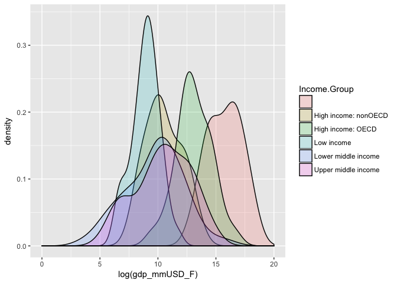

<table style="width:4%;">
<colgroup>
<col width="4%" />
</colgroup>
<tbody>
<tr class="odd">
<td>Kouvaris, Peter - Case Study 01</td>
</tr>
</tbody>
</table>

Tools Review
------------

This report was completed using R. Libraries and version information are
included below:

    R.Version()

    ## $platform
    ## [1] "x86_64-apple-darwin13.4.0"
    ## 
    ## $arch
    ## [1] "x86_64"
    ## 
    ## $os
    ## [1] "darwin13.4.0"
    ## 
    ## $system
    ## [1] "x86_64, darwin13.4.0"
    ## 
    ## $status
    ## [1] ""
    ## 
    ## $major
    ## [1] "3"
    ## 
    ## $minor
    ## [1] "3.2"
    ## 
    ## $year
    ## [1] "2016"
    ## 
    ## $month
    ## [1] "10"
    ## 
    ## $day
    ## [1] "31"
    ## 
    ## $`svn rev`
    ## [1] "71607"
    ## 
    ## $language
    ## [1] "R"
    ## 
    ## $version.string
    ## [1] "R version 3.3.2 (2016-10-31)"
    ## 
    ## $nickname
    ## [1] "Sincere Pumpkin Patch"

    suppressMessages(library(digest)) #for SHA1 
    suppressMessages(library(ggplot2)) #for visualizations

Data Import & Cleaning
----------------------

The data used in the study was pulled from the World Bank's open online
databases. Original sources can be found here:  
[GDP Ranking
Data](http://data.worldbank.org/data-catalog/GDP-ranking-table)  
[EDU Stats Data](http://data.worldbank.org/data-catalog/ed-stats) The
data is made up of two tables, both comprised of economic variables on a
per country basis.

    gdp_global <- read.csv("https://d396qusza40orc.cloudfront.net/getdata%2Fdata%2FGDP.csv")
    # e38fd47ab0775ed957b7eefb3a6884aa2f23730a
    edu <- read.csv("https://d396qusza40orc.cloudfront.net/getdata%2Fdata%2FEDSTATS_Country.csv")
    # 64e11f8dc2a256854ef0144765541c9a8f108a37

If the data is not still accessible at the time of review, csv versions
of the sets have been saved in the data directory of this project.

The gdp\_global variable is not formatted correctly. To fix this, (1)
subset it into a new memory object, (2) remove empty space at the top of
the dataframe pulled when importing, (3) subset the appropriate rows and
columns, and finally (4) rename the columns for easy reference.

    #             (1)                 (2)     (3a)          (3b)
    clean_gdp <- subset(gdp_global[5:length(gdp_global$X),c(1,2,4,5)])
    #                   (4)
    colnames(clean_gdp)  <- c("country_code","rank","country","gdp_mmUSD")

1 Merge
-------

Merging on the marching CountryCode fields and then checking the length
of the merged dataframe to see how many coutry codes matched.

    merged_df <- merge(clean_gdp, edu, by.x = "country_code", by.y = "CountryCode")
    length(merged_df$country_code)

    ## [1] 224

    ### 224 country codes matched and merged

224 of the country codes in the global GDP set matched those in the Edu
set.

2 Sort
------

Sorting the data shows that the formatting for GDP in USD is not
numeric. Cleaning the commas and converting to the proper data type must
be completed first. Then, selecing the 13th row after the ascending sort
has been applied.

    merged_df$gdp_mmUSD_F <- as.numeric(gsub("[^[:digit:]]","", merged_df$gdp_mmUSD))
    sorted <- merged_df[order(merged_df$gdp_mmUSD_F),]
    sorted[13,]

    ##     country_code rank             country gdp_mmUSD           Long.Name
    ## 106          KNA  178 St. Kitts and Nevis      767  St. Kitts and Nevis
    ##            Income.Group                    Region Lending.category
    ## 106 Upper middle income Latin America & Caribbean             IBRD
    ##     Other.groups         Currency.Unit Latest.population.census
    ## 106              East Caribbean dollar                     2001
    ##     Latest.household.survey Special.Notes National.accounts.base.year
    ## 106                                                              1990
    ##     National.accounts.reference.year System.of.National.Accounts
    ## 106                               NA                        1993
    ##     SNA.price.valuation Alternative.conversion.factor PPP.survey.year
    ## 106                 VAB                                            NA
    ##     Balance.of.Payments.Manual.in.use External.debt.Reporting.status
    ## 106                              BPM5                    Preliminary
    ##     System.of.trade Government.Accounting.concept
    ## 106         General                  Consolidated
    ##     IMF.data.dissemination.standard
    ## 106                            GDDS
    ##     Source.of.most.recent.Income.and.expenditure.data
    ## 106                                                  
    ##     Vital.registration.complete Latest.agricultural.census
    ## 106                                                       
    ##     Latest.industrial.data Latest.trade.data Latest.water.withdrawal.data
    ## 106                     NA              2007                           NA
    ##     X2.alpha.code WB.2.code          Table.Name          Short.Name
    ## 106            KN        KN St. Kitts and Nevis St. Kitts and Nevis
    ##     gdp_mmUSD_F
    ## 106         767

The 13th country as shown in the output is St. Kitts and Nevis, with a
GDP in Millions of USD of 767.

3 Average GDP Rankings
----------------------

The rank variable must first be coerced as type numeric so that mean
operations can be performed. Because some values are empty strings "",
they must first be turned to NA so that when converting to type numeric
they do not turn into integers worth 1 and skew the average calculation.
Then, grouping by Income Group and ignoring NA values, the average can
be calculated for the Income Groups.

    sorted$rank[(sorted$rank == "")] <- 0

    ## Warning in `[<-.factor`(`*tmp*`, (sorted$rank == ""), value =
    ## structure(c(103L, : invalid factor level, NA generated

    sorted$rank <- as.numeric(sorted$rank)
    aggregate(sorted$rank, list(sorted$Income.Group), mean, na.rm=TRUE, na.action=NULL)

    ##                Group.1         x
    ## 1                            NaN
    ## 2 High income: nonOECD  93.73913
    ## 3    High income: OECD 110.06667
    ## 4           Low income  66.97297
    ## 5  Lower middle income 105.03704
    ## 6  Upper middle income 106.13333

The average GDP ranking for High income: nonOECD is 93.73913 and
110.06667 High income: OECD, where a higher ranking

4 Color Ploats By Income Group
------------------------------

GDP being a monetary value means that the data is right-skewed to the
point where many distribution visualizations are weak. To adjust the
visualization so that the income groups can be compared, the amount in
USD millions was log transformed.

    log_cut <- ggplot(sorted, aes(x=log(gdp_mmUSD_F), fill=Income.Group))
    log_cut +  geom_density(alpha = 0.2) + xlim(0, 20)

    ## Warning: Removed 21 rows containing non-finite values (stat_density).

When transformed and plotted we can see that there are varying
distribution shapes among income groups, notably that the densities of
"Low income" and "High income: OECD | nonOECD" nations are large, where
middle income nations have wider intervals of possible values.

5 Summary Statistics Per Income Group
-------------------------------------

Now that we have reviewed the shape of different income groups, lets
review the summary statistics on the non-transformed data to get an
understanding of differences in values:

    groups <- c("High income: nonOECD", "High income: OECD", "Low income", "Lower middle income", "Upper middle income")
    for (x in groups) {
      print(x)
      print(summary(sorted$gdp_mmUSD_F[sorted$Income.Group == x]))
    }

    ## [1] "High income: nonOECD"
    ##    Min. 1st Qu.  Median    Mean 3rd Qu.    Max.    NA's 
    ##    2584   12840   28370  104300  131200  711000      14 
    ## [1] "High income: OECD"
    ##     Min.  1st Qu.   Median     Mean  3rd Qu.     Max. 
    ##    13580   211100   486500  1484000  1480000 16240000 
    ## [1] "Low income"
    ##    Min. 1st Qu.  Median    Mean 3rd Qu.    Max.    NA's 
    ##     596    3814    7843   14410   17200  116400       3 
    ## [1] "Lower middle income"
    ##    Min. 1st Qu.  Median    Mean 3rd Qu.    Max.    NA's 
    ##      40    2549   24270  256700   81450 8227000       2 
    ## [1] "Upper middle income"
    ##    Min. 1st Qu.  Median    Mean 3rd Qu.    Max.    NA's 
    ##     228    9613   42940  231800  205800 2253000       2

The differences noted in the distribution plot can also be seen here.

6 Quantile Testing
------------------

To understand how many "Lower middle income" economies are in the
largest 38 countries when ranking based on GDP in Millions of USD, first
remove all meta-data points that do not belong to countries, but instead
to larger classifications. Dropping items where rank is equal to NA
achieves this. Then sorting the result and selecting the last 38th,
gives us the final quantile.

    quantile_df <- sorted[!is.na(sorted$rank),]
    quantile_df <- quantile_df[order(quantile_df$gdp_mmUSD_F),]
    end <- length(quantile_df$rank)
    largest_38 <- quantile_df[(end-38):end,]
    large_lwi <- largest_38[largest_38$Income.Group == "Lower middle income", ]

There are 6 countries the meet this criteria .Nigeria, Egypt, China,
India, Indonesia, and Thailand.

Conclusion
----------

When reviewing all the items individually analyzed above, increased
understanding between then shape of GDP in MM USD versus Income Group
can be gained. High or low income groups have a much higher density,
meaning that a more narrow range can be placed on the GDP of countries
with incomes on either the lower or higher end. The middle portions,
"Upper middle income" and "Lower middle income", span across wider
ranges. For countries classified in this way, there can be a large
range. One may consider the reason for this to be the economies of scale
available at some point when an econonmy is slightly larger than Low
income economies. There most likely exists a economic point where the
production of a country increases rapidly that is out of range from the
narrowly distributed "Low income" nations, but achievable by middle
income ones. We can assume this point exists somewhere around the
positive standard deviations of middle income rated countries, seeing as
they have a tendancy to have wider distributions that span to the right
into the area of higher income economies.
